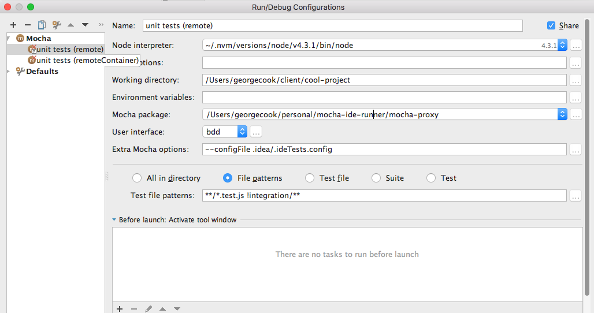

# Mocha ide Runner

> Run Mocha unit tests on remote hosts, in docker containers, or both

## Why?
I use intelliJ and love it's tight unit testing integration. Docker is more prevalent now, and
intelliJ doesn't allow one to launch tests within a docker container.

### But why remote machines, or docker on a remote machine?
Over the last year I've found myself using various workflows. I have a beastly gaming pc which I
host docker machines on while working as docker for mac has sucky performance and until recently
was pretty much unusable. Even now, with docker for mac being more stable, I stil prefer to run
my unit tests on a remote linux server (either my game pc, or something in the cloud) whenever
posisble.

So this tool has you covered whether you want to run unit tests in docker, or in a vm, another
machine, or a docker container running in a vm or another machine.

## How to use

1. `npm install` in the mocha-ide-runner folder, to load all the required packages
1. Setup the run configuration in your ide
1. Setup a config file with required properties 


### Configure your IDE
#### IntelliJ/Webstorm
  * In IntelliJ, create a new _run configuration_ for your unit tests, with the following settings:
    * __node interperter__, your version of node
    * __working directory__, to the folder the project being tested is in
    * __mocha package__, to `[Folder where this project is cloned]/mocha-proxy`
    * __User interface__ bdd (__*this is very important*__)
    * __Files to be tested__, select either a recursive folder, or file patterns. Patterns are
    glob format and multiple can be provided, separated by spaces. e.g.
    * Set the Extra mocha options:
      * __--configFile__ path to .ideTestSettings.config (see next section)
      * --mode - optional override of mode config argument. I find this useful for cases where I might sometimes run a tests using remoteContainer, or othertimes just remote. e.g. I can then use the same .ideTests.config file for my unit and integration test run targets, despite my integration tests requiring execution in a docker container, by simply changing the mode, and the file patterns




### Create a config file

Create a config file for your current project. This is best in a place ignored by your version control e.g *.idea/.ideTestSettings.config* 
  
####Config file example

```
{
  "ide": "intellij",
  "mode": "remote",
  "remoteHost": "mordor",
  "mochaPath": "node_modules/mocha",
  "localSourcePath": "/Users/georgecook/client/cool-project",
  "localTempFilesPath": "/tmp/mochaIdeFiles",
  "remoteSourcePath": "/home/george/work/client/cool-project",
  "remoteTempFilesPath": "/tmp/mochaIdeFiles",
  "containerSourcePath": "/src",
  "containerTempFilesPath": "/tmp/mochaIdeFiles",
  "containerName": "client/some-super-cool-internet-thing"
}
```

####Description of config file properties

|  property | description  | 
|---|---|
|  ide | intellij, more soon.. defines ide launching the tests |
|  mode | remote,container,remoteContainer - remote runs the tests on a remote machine. container runs them in a local docker container, remoteContainer, on a docker container inside a remote machine. All remote access is via ssh |
|  remoteHost | remote hostname (and/or user, e.g. george@myMachine). This should be in your ssh config and _not_ require username/password authentication). It is also recommended that you set up [ssh connection sharing](https://puppet.com/blog/speed-up-ssh-by-reusing-connections) to keep things snappy | 
|  mochaPath | path to mocha package which will run the tests, can be absolute or relative to the sourcePath |
|  localSourcePath | root path of the project on the machine that is running your ide  |
|  localTempFilesPath | a path on your machine where the runner can store some temporary files  |
|  remoteSourcePath | root path of the project on the remote machine. Required if using a remote mode  |
|  remoteTempFilesPath | a path on the remote machine where the runner can store some temporary files. Required if using a remote mode  |
|  containerName | id of the container that will run the tests. This corresponds to the image name column when you do a `docker ps`.  Required if using a container mode  |
|  containerSourcePath | root path of the project on the container - usually `/src`. Required if using a container mode  |
|  containerTempFilesPath | a path on the container where the runner can store some temporary files. Required if using a container mode  |
|  useBabel | if true, will pass the `--compilers js:babel-register` arg to mocha |

####A note about paths
The localSourcePath, remoteSourcePath and containerSourcePath must all be absolute and exactly how the os resolves them. e.g. I have symlinks such as `~/client`; but I _must_ enter the path as `/Users/georgecook/client` - failure to do this will break the mappings, or perhaps even faily to run the tests.

##Running

  1. If using a docker mode, ensure that your docker container (and all dependencies) are running
  1. If using a remote mode, ensure that you have setup your ssh config so you can ssh into the remote machine without requiring a username or password. Also set up [ssh connection sharing](https://puppet.com/blog/speed-up-ssh-by-reusing-connections) to keep things snappy.
  1. Execute your tests. The unit test results will show you the tests that were exeucted, and the log output for each step. Click on the *Test Results* root item, to get the full log output (useful for debugging any errors with your options, such as badly configured paths.)
      


## Credits
Based on work from fake-mocha, which was written by [TechnologyAdvice](http://technologyadvice.com).
Their license can be found in `TechnologyAdviceLicense.txt`, and their github repo is [here](https://github.com/TechnologyAdvice/fake-mocha)
